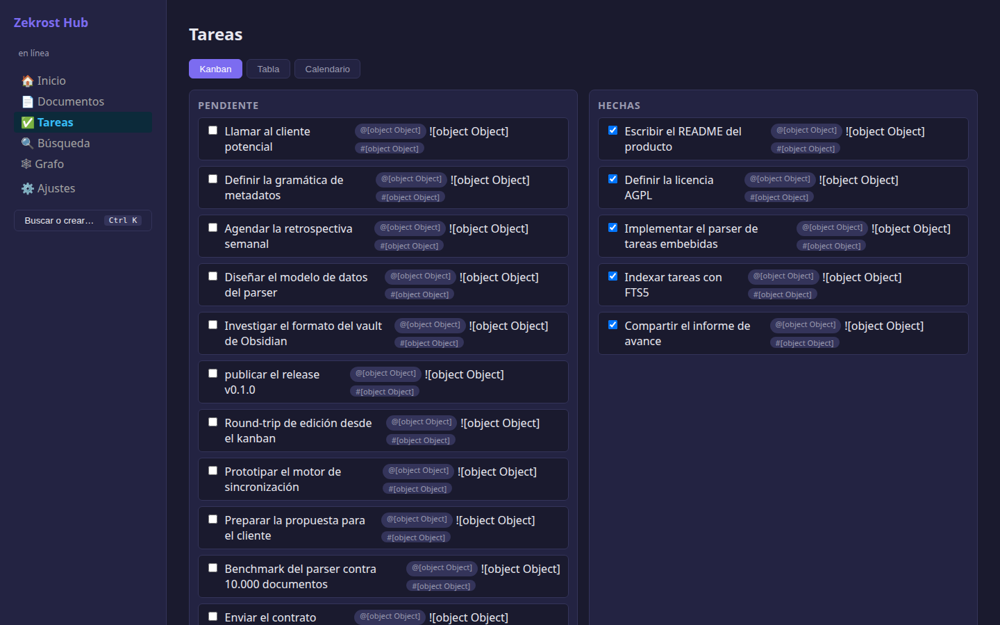
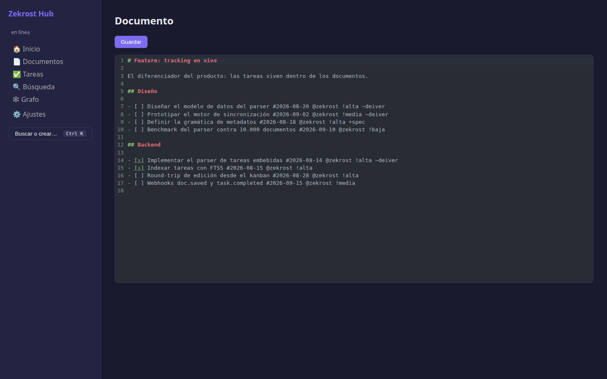
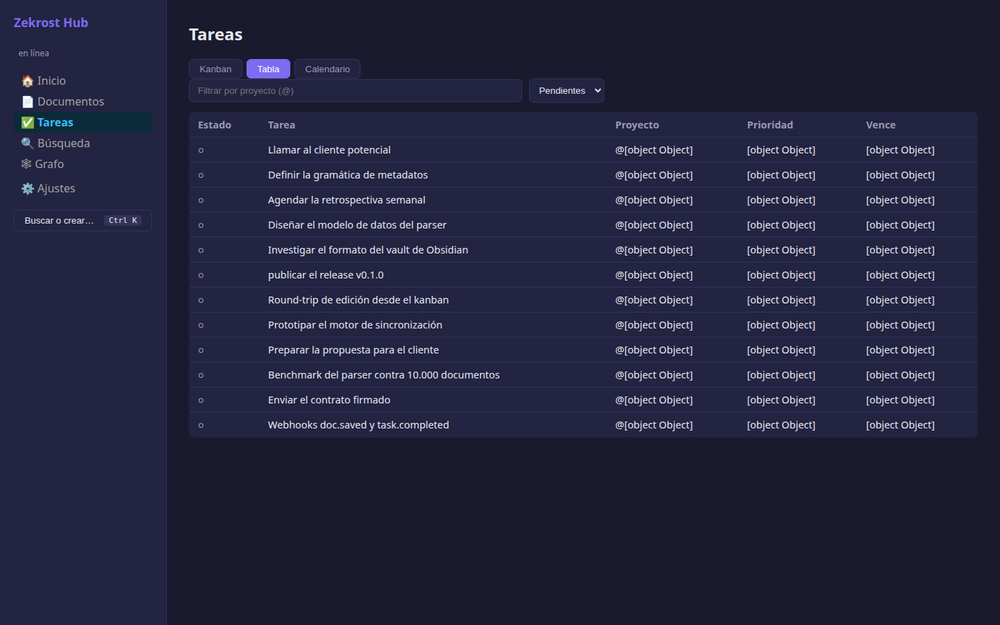
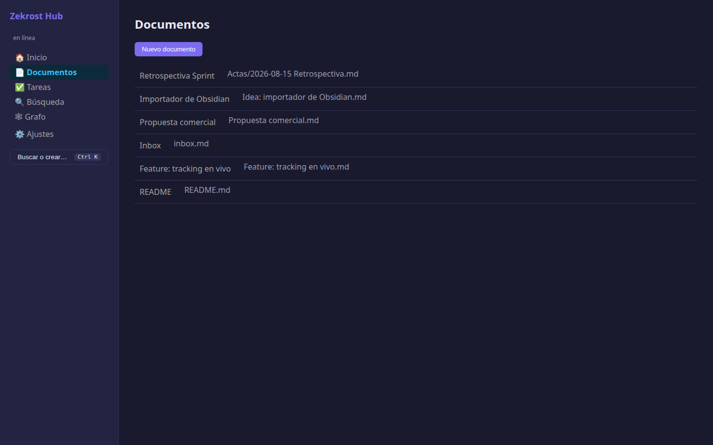

<div align="center">

# Zekrost Hub

**Your docs and your tasks in one place — self-hosted, offline-first, and fast like a native app.**

Write in Markdown. Keep your tasks *inside* your documents. Zekrost Hub turns them into a kanban, a table, and a calendar automatically — because **the files are the source of truth, and everything else is just a lens on the same data**.

[](LICENSE)
[](https://go.dev)
[](https://nix-js.dev)
[](https://github.com/Zekrost/Zekrost-Hub/actions)

[Website](https://zekrost.dev) · [Architecture](docs/ARCHITECTURE.md) · [Report a bug](https://github.com/Zekrost/Zekrost-Hub/issues)

</div>

---

<p align="center">
  
</p>

## What is it?

A single, lightweight binary that replaces the usual pile of tools — a wiki here, a kanban there, a drive somewhere else. No accounts on someone else's cloud. No five containers to maintain.

```markdown
# Feature: live tracking

- [ ] Design the task parser data model #2026-08-20 @zekrost !alta ~deiver
- [x] Implement embedded task parsing #2026-08-14 @zekrost !alta
```

That file *is* your project board. Complete a task in the kanban and it marks the checkbox in the document — same entity, two views.

## Features

**📄 Documents**
- Markdown editor with live preview (CodeMirror 6) — LaTeX, Mermaid, syntax highlighting
- `[[Wiki-links]]`, backlinks and a relationship graph
- Drag-and-drop attachments (local disk or S3-compatible)
- Version history; the losing version is always preserved
- Templates: proposal, meeting notes, RFC, retrospective

**✅ Embedded tasks**
- Natural-language metadata: `#due-date @project !priority ~assignee +tag`
- **Kanban, table and calendar views** — generated from the index, never stored
- **Quick Add Magic**: press `Ctrl+K`, type `call client #tomorrow @sales !high`, done
- Round-trip guaranteed: editing from any view rewrites the source line *byte for byte*

**⚙️ Platform**
- **Offline-first by design**: local command queue with replay, delta sync on reconnect
- **One binary**: Go + SQLite + embedded frontend. One container, one volume, zero external dependencies — `<100 MB RAM`
- **API-first**: everything the UI can do, the REST API can do — with webhooks
- Full-text search (FTS5) with typo tolerance
- Workspaces with roles (owner / editor / viewer)
- **PWA** installable; native iOS/Android via Capacitor sharing 100% of the code

## Quickstart

**Docker — one command:**

```bash
docker run -d \
  -v hub-data:/data \
  -p 8080:8080 \
  -e HUB_JWT_SECRET=<your-secret> \
  ghcr.io/zekrost/hub:latest
```

Open [http://localhost:8080](http://localhost:8080).

| Environment variable | Required | Description |
|:--|:--:|:--|
| `HUB_JWT_SECRET` | ✅ | Secret used to sign JWT tokens |
| `HUB_BIND` | | Listen address (default `:8080`) |
| `HUB_DB_PATH` | | SQLite index path (default `data/hub.db`) |
| `HUB_DATA_DIR` | | Canonical documents directory (default `data`) |
| `HUB_STORAGE` | | `local` or `s3` (Cloudflare R2 / MinIO / AWS) |

**Backup** = stop → copy `data/` → done. One directory is everything.

## Screenshots

<p align="center">
  
  
  <br />
  
</p>

## Development

Requirements: [Go 1.26+](https://go.dev/dl), [Node.js 22+](https://nodejs.org), [sqlc](https://sqlc.dev) v1.31.

```bash
git clone git@github.com:Zekrost/Zekrost-Hub.git
cd Zekrost-Hub

make frontend   # build the Nix.js frontend and embed it
make generate   # regenerate sqlc code
make dev        # Go backend on :8080
```

In another terminal:

```bash
cd web
npm run dev     # Vite dev server on :5173 (proxies /api → :8080)
```

| Command | What it does |
|:--|:--|
| `make build` | Single binary with embedded frontend |
| `make test` | Backend tests (Go) |
| `make vet` | `go vet` + TypeScript typecheck |
| `make docker` | Multi-stage Docker image |

## Architecture

```
┌───────────────────────────────────────────────┐
│ CLIENT — one codebase                         │
│ Nix.js SPA → PWA (browser) | Capacitor (apps)  │
│ Offline queue (IndexedDB) + delta sync         │
└──────────────────────────┬────────────────────┘
                           │ HTTPS / REST (JSON)
┌──────────────────────────▼────────────────────┐
│ GO BINARY — one process                       │
│ Gin · JWT · task parser · FTS5 · webhooks      │
│ ├─ SQLite (modernc) — index & cache            │
│ ├─ Markdown store — canonical files            │
│ └─ Attachments — S3 interface (local/R2/MinIO) │
└───────────────────────────────────────────────┘
```

**Core principles** (from the [technical architecture](docs/ARCHITECTURE.md)):
1. Files are the truth; the database is a rebuildable index.
2. Offline-first from birth; no feature assumes connectivity.
3. One artifact; if it needs five services to start, it has already failed.
4. API-first: the UI is just another client.
5. Budget: <100 MB RAM per instance, <10 s cold start.

**Stack:** Go 1.26 · Gin v1.12 · sqlc v1.31 · SQLite (FTS5) · Nix.js 2.6 · CodeMirror 6 · FlexSearch · Capacitor 8 · GitHub Actions + GoReleaser

## API

Everything the UI does, the API does. Bearer-token auth.

```bash
# Register & login
curl -X POST localhost:8080/api/v1/auth/register \
  -H 'Content-Type: application/json' \
  -d '{"email":"you@example.com","password":"min8chars","display_name":"You"}'

# Quick Add Magic
curl -X POST localhost:8080/api/v1/tasks \
  -H "Authorization: Bearer $TOKEN" -H 'Content-Type: application/json' \
  -d '{"text":"review invoices #tomorrow @zekrost !high"}'

# Views are projections of the index
curl "localhost:8080/api/v1/tasks?vista=calendar&desde=2026-09-01&hasta=2026-09-30" \
  -H "Authorization: Bearer $TOKEN"

# Offline sync (delta by cursor)
curl "localhost:8080/api/v1/sync/changes?since=0" -H "Authorization: Bearer $TOKEN"
```

Full endpoint reference is in [docs/ARCHITECTURE.md](docs/ARCHITECTURE.md).

## Contributing

Issues, ideas and pull requests are welcome. We dogfood the product — Zekrost and BikerOS are managed with Zekrost Hub.

Before submitting a PR, please open an issue or comment on an existing one so the approach is agreed on before code is written.

## License

**AGPL-3.0-only** — see [LICENSE](LICENSE) and [NOTICE](NOTICE).

The self-hosted product is free and complete. Paid offerings (encrypted sync service, hosted cloud, team plans) are convenience services that never restrict what runs on your own server. Anyone who hosts the product must open their code.

---

<p align="center">Built by <a href="https://github.com/Zekrost">Zekrost</a> — dogfooding our own product since day one.</p>
